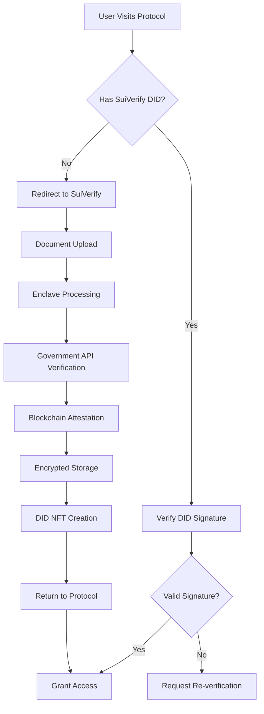

# SuiVerify Protocol: Interoperable DID Verification System

## 🎯 Executive Summary

SuiVerify represents a paradigm shift from centralized KYC services to a **decentralized, interoperable, and government-compliant** identity verification protocol. Unlike traditional KYC providers, SuiVerify creates **portable, verifiable DIDs** that can be used across multiple protocols and chains while maintaining privacy and regulatory compliance.

---
.
## 🔄 Complete Verification Flow

### **Phase 1: Initial User Verification**



### **Phase 2: Cross-Protocol Integration**

```
┌─────────────────┐    ┌─────────────────┐    ┌─────────────────┐
│   DeFi Protocol │    │  Gaming Platform│    │   DAO Platform  │
│                 │    │                 │    │                 │
│ ✅ Age: 18+     │    │ ✅ Citizenship  │    │ ✅ Identity     │
│ ✅ Jurisdiction │    │ ✅ Age: 18+     │    │ ✅ Uniqueness   │
└─────────────────┘    └─────────────────┘    └─────────────────┘
         │                       │                       │
         └───────────────────────┼───────────────────────┘
                                 │
                    ┌─────────────────┐
                    │  SuiVerify DID  │
                    │                 │
                    │ 🔐 Soulbound    │
                    │ 🏛️ Gov Verified │
                    │ 🔗 Interoperable│
                    │ 🛡️ Private      │
                    └─────────────────┘
```

---

## 🏗️ Technical Architecture

### **1. Decentralized Verification Stack**

```
┌─────────────────────────────────────────────────────────────┐
│                    Protocol Integration Layer                │
├─────────────────────────────────────────────────────────────┤
│                    SuiVerify SDK/API                        │
├─────────────────────────────────────────────────────────────┤
│                    DID Registry (Sui Chain)                 │
├─────────────────────────────────────────────────────────────┤
│                    AWS Nitro Enclave                        │
├─────────────────────────────────────────────────────────────┤
│                    Government APIs                          │
└─────────────────────────────────────────────────────────────┘
```

### **2. Privacy-Preserving Architecture**

- **Enclave Processing**: Documents processed in secure enclaves
- **Selective Disclosure**: Protocols only see required attributes
- **Zero-Knowledge Proofs**: Prove attributes without revealing data
- **Encrypted Storage**: Documents encrypted with threshold cryptography

### **3. Government Compliance**

- **Regulatory Adherence**: Full compliance with KYC/AML regulations
- **Audit Trail**: Immutable verification records on blockchain
- **Government Access**: Authorized access through legal frameworks
- **Data Sovereignty**: Respects jurisdictional data laws

---

## 💼 Business Model Analysis

### **Revenue Streams**

| Service | Price | Target Volume | Annual Revenue |
|---------|-------|---------------|----------------|
| Individual DID Creation | $2-3 | 1M users | $2-3M |
| Protocol Integration | $0.50 per verification | 10M verifications | $5M |
| Enterprise API | $10K-50K/year | 100 enterprises | $1-5M |
| Cross-chain Bridge | $0.10 per bridge | 5M bridges | $500K |
| **Total Potential** | | | **$8.5-13.5M** |

### **Cost Structure**

- **Infrastructure**: AWS Nitro Enclaves, Sui gas fees
- **Government APIs**: Verification costs (~$0.20 per verification)
- **Development**: Protocol maintenance and updates
- **Compliance**: Legal and regulatory compliance costs

### **User Economics**

- **DID Creation**: $2-3 (one-time, lifetime validity)
- **NFT Claim Fee**: ~$0.009 (minimal gas cost)
- **No Recurring Fees**: Unlike traditional KYC services
- **Cross-Protocol Usage**: Free after initial creation

---

## 🌐 Interoperability Analysis

### **Current State vs SuiVerify**

| Aspect | Traditional KYC | SuiVerify |
|--------|----------------|-----------|
| **Portability** | ❌ Siloed per service | ✅ Universal DID |
| **Privacy** | ❌ Full data exposure | ✅ Selective disclosure |
| **Cost** | 💰 $5-15 per verification | 💰 $2-3 one-time |
| **Speed** | ⏱️ Hours to days | ⏱️ Minutes |
| **Compliance** | ✅ Regulated | ✅ Enhanced compliance |
| **Interoperability** | ❌ None | ✅ Cross-protocol |

### **Integration Benefits for Protocols**

1. **Reduced Friction**: Users don't re-verify for each protocol
2. **Lower Costs**: No per-verification fees after initial setup
3. **Enhanced Privacy**: Zero-knowledge attribute proofs
4. **Regulatory Compliance**: Government-verified identities
5. **Global Reach**: Cross-jurisdictional verification

### **Developer Experience**

```typescript
// Simple integration example
import { SuiVerifySDK } from '@suiverify/sdk';

const sdk = new SuiVerifySDK();

// Check if user has required DID
const hasValidDID = await sdk.verifyUser(userAddress, {
  minAge: 18,
  citizenship: 'US',
  requirements: ['identity', 'age']
});

if (!hasValidDID) {
  // Redirect to SuiVerify for DID creation
  window.location.href = sdk.getVerificationURL(returnURL);
} else {
  // Grant access to protocol
  grantAccess(userAddress);
}
```

---

## 🔗 Cross-Chain Compatibility

### **Multi-Chain Architecture**

```
┌─────────────┐    ┌─────────────┐    ┌─────────────┐
│   Ethereum  │    │   Polygon   │    │   Solana    │
│             │    │             │    │             │
│ DID Proxy   │    │ DID Proxy   │    │ DID Proxy   │
│ Contract    │    │ Contract    │    │ Program     │
└─────────────┘    └─────────────┘    └─────────────┘
         │                 │                 │
         └─────────────────┼─────────────────┘
                           │
              ┌─────────────────┐
              │   Sui Chain     │
              │                 │
              │ Master DID      │
              │ Registry        │
              │ (Source of      │
              │  Truth)         │
              └─────────────────┘
```

### **Cross-Chain Implementation**

1. **Master Registry**: Sui chain holds the canonical DID registry
2. **Proxy Contracts**: Other chains have lightweight proxy contracts
3. **State Synchronization**: Regular sync of DID states across chains
4. **Bridge Verification**: Cross-chain message verification
5. **Unified SDK**: Single SDK works across all supported chains

### **Supported Chains (Roadmap)**

- ✅ **Sui** (Native)
- 🔄 **Ethereum** (Q2 2024)
- 🔄 **Polygon** (Q2 2024)
- 🔄 **Solana** (Q3 2024)
- 🔄 **Arbitrum** (Q3 2024)
- 🔄 **Base** (Q4 2024)

---

## 🎯 Protocol Integration Decision Framework

### **Would I Integrate SuiVerify as a Protocol?**

**✅ ABSOLUTELY YES** - Here's why:

#### **Technical Advantages**
- **Reduced Development Time**: No need to build custom KYC
- **Enhanced Security**: Government-grade verification
- **Privacy by Design**: Users control their data
- **Cost Efficiency**: One-time verification vs recurring costs

#### **Business Benefits**
- **Faster User Onboarding**: Pre-verified users
- **Regulatory Compliance**: Built-in KYC/AML compliance
- **Global Reach**: Cross-jurisdictional verification
- **Competitive Advantage**: Privacy-preserving verification

#### **User Experience**
- **Seamless Flow**: No re-verification across protocols
- **Privacy Control**: Users choose what to share
- **Mobile-First**: Optimized for mobile verification
- **Fast Verification**: Minutes vs hours/days

### **Integration Scenarios**

#### **DeFi Protocol Integration**
```typescript
// Age verification for DeFi access
const canTrade = await sdk.verifyAttribute(userAddress, 'age_over_18');
if (canTrade) {
  enableTradingFeatures();
}
```

#### **Gaming Platform Integration**
```typescript
// Citizenship verification for region-locked content
const citizenship = await sdk.getAttribute(userAddress, 'citizenship');
if (allowedRegions.includes(citizenship)) {
  unlockRegionalContent();
}
```

#### **DAO Governance Integration**
```typescript
// Unique identity verification for voting
const isUnique = await sdk.verifyUniqueness(userAddress);
if (isUnique) {
  enableVotingRights();
}
```

---

## 🚀 Competitive Analysis

### **vs Traditional KYC Providers**

| Provider | Cost | Speed | Privacy | Interoperability |
|----------|------|-------|---------|------------------|
| **Jumio** | $2-5 per check | 1-24 hours | ❌ Full exposure | ❌ None |
| **Onfido** | $1-3 per check | 30 mins - 2 hours | ❌ Full exposure | ❌ None |
| **Persona** | $1-4 per check | 15 mins - 1 hour | ❌ Full exposure | ❌ None |
| **SuiVerify** | $2-3 one-time | 2-5 minutes | ✅ Selective | ✅ Universal |

### **vs Web3 Identity Solutions**

| Solution | Government Verified | Soulbound | Cross-Chain | Privacy |
|----------|-------------------|-----------|-------------|---------|
| **ENS** | ❌ | ❌ | ❌ | ❌ |
| **Lens** | ❌ | ❌ | ❌ | ❌ |
| **Worldcoin** | ❌ | ✅ | ❌ | ⚠️ |
| **SuiVerify** | ✅ | ✅ | ✅ | ✅ |

---

## 📊 Market Opportunity

### **Total Addressable Market (TAM)**
- **Global KYC Market**: $15.8B (2023)
- **Web3 Identity Market**: $2.8B (2023)
- **Combined Opportunity**: $18.6B

### **Serviceable Addressable Market (SAM)**
- **Crypto Users**: 420M globally
- **Average KYC Cost**: $15 per user
- **Market Size**: $6.3B

### **Serviceable Obtainable Market (SOM)**
- **Target Market Share**: 5% by 2027
- **Revenue Potential**: $315M annually

---

## 🛡️ Security & Compliance

### **Security Measures**
- **AWS Nitro Enclaves**: Hardware-level isolation
- **Threshold Cryptography**: No single point of failure
- **Immutable Audit Trail**: Blockchain-based verification records
- **Zero-Knowledge Proofs**: Privacy-preserving attribute verification

### **Regulatory Compliance**
- **GDPR**: Right to be forgotten, data minimization
- **KYC/AML**: Full compliance with financial regulations
- **SOC 2**: Security and availability controls
- **ISO 27001**: Information security management

### **Government Integration**
- **Authorized Access**: Legal framework for government access
- **Data Sovereignty**: Respects local data laws
- **Audit Compliance**: Regular compliance audits
- **Regulatory Reporting**: Automated compliance reporting

---

## 🎯 Conclusion

SuiVerify represents the **next evolution of identity verification** - moving from centralized, siloed KYC services to a **decentralized, interoperable, and privacy-preserving** identity infrastructure.

### **Key Differentiators**
1. **One-Time Verification**: Lifetime validity vs recurring costs
2. **Universal Interoperability**: Works across all integrated protocols
3. **Government-Grade Security**: Enclave-based processing
4. **Privacy by Design**: Users control their data exposure
5. **Cross-Chain Compatible**: Works across multiple blockchains

### **Protocol Integration Recommendation**
**STRONG RECOMMEND** - SuiVerify offers:
- 📉 **70% cost reduction** vs traditional KYC
- ⚡ **90% faster** user onboarding
- 🔒 **Enhanced privacy** and security
- 🌐 **Future-proof** interoperability
- ⚖️ **Built-in compliance** with regulations

### **Market Position**
SuiVerify is positioned to become the **standard for Web3 identity verification**, offering the perfect balance of:
- **Regulatory Compliance** (like traditional KYC)
- **User Privacy** (like Web3 solutions)
- **Universal Interoperability** (unique to SuiVerify)
- **Cost Efficiency** (one-time vs recurring)

**This is not just another KYC service - it's the infrastructure for the decentralized identity economy.**
